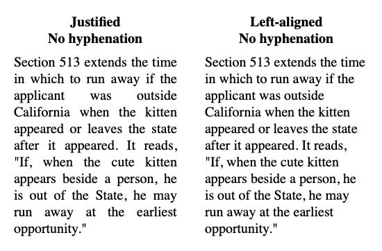
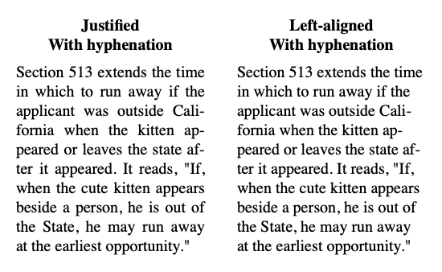

# Hyphenation

Efficient and flexible automatic hyphenation using the Knuth-Liang algorithm.

See full documentation at [https://john-mueller.github.io/Hyphenation](https://john-mueller.github.io/Hyphenation).

## Table of Contents

- [Introduction](#introduction)
- [Installation](#installation)
- [Usage](#usage)
    - [Exceptions](#exceptions)
    - [Custom Patterns](#custom-patterns)
    - [Thread Safety](#thread-safety)
    - [HTML/Code](#htmlcode)
- [Contributing](#contributing)
- [License](#license)
- [Credits](#credits)

## Introduction

The primary purpose of this library is to automatically insert soft hyphens into text to improve its layout flow. Consider the following example from [Butterick's Practical Typography](https://practicaltypography.com/justified-text.html):



As line length decreases, justified text often displays large gaps between words, while left- or right-aligned text displays increasingly uneven margins. By inserting soft hyphens into words (which are only displayed when they fall at the end of a line), the text can be split more naturally across multiple lines, improving the text's aesthetic appearance:



This proves useful in HTML (since the `hyphens` CSS property is [not universally supported](https://caniuse.com/#search=hyphen)), and will even work in UIKit and SwiftUI text components.

## Installation

Hyphenation is installed via the [Swift Package Manager](https://swift.org/package-manager/). First, add it to your dependencies:

```swift
let package = Package(
    ...
    dependencies: [
        .package(url: "https://github.com/john-mueller/Hyphenation.git", from: "0.2.0")
    ],
    ...
)
```

Then import the Hyphenation module wherever it is needed:

```swift
import Hyphenation
```

## Usage

Basic usage just requires creating a `Hyphenator` instance and calling its `hyphenate(text:)` method:

```swift
let hyphenator = Hyphenator()
hyphenator.separator = "-"

let text = "This algorithm identifies likely hyphenation points."
print(hyphenator.hyphenate(text: text))
// This al-go-rithm iden-ti-fies like-ly hy-phen-ation points.
```

You can also remove the `separator` character from a string by calling `unhyphenate(text:)`:

```swift
let hyphenatedText = "This al-go-rithm iden-ti-fies like-ly hy-phen-ation points."
print(hyphenator.unhyphenate(text: hyphenatedText))
// This algorithm identifies likely hyphenation points.
```

Note that if the original string contained the `separator` character, the `unhyphenate(text:)` method will remove those instances as well, so hyphenating and unhyphenating a string may not recover the original string.

### Exceptions

The algorithm is designed to prioritize the prevention of incorrect hyphenations over finding every correct hyphenation—missing a single hyphenation rarely effects text flow meaningfully, but bad hyphenation can be rather noticable. Because the patterns were derived from a English dictionary, it can make good guesses about many words that do not appear in a dictionary.

```swift
let hyphenator = Hyphenator()
hyphenator.separator = "-"

print(hyphenator.hyphenate(text: "swiftlang supercalifragilisticexpialidocious"))
// swift-lang su-per-cal-ifrag-ilis-tic-ex-pi-ali-do-cious
```

Nevertheless, the algorithm may occasionally produce unexpected results for brand names or other unusual words. In this case, you may manually specify a desired hyphenation using exceptions.

```swift
print(hyphenator.hyphenate(text: "Microsoft sesquipedalian"))
// Mi-crosoft sesquipedalian

hyphenator.addCustomExceptions(["Micro-soft", "ses-qui-pe-da-li-an"])

print(hyphenator.hyphenate(text: "Microsoft sesquipedalian"))
// Micro-soft ses-qui-pe-da-li-an
```

To remove custom exceptions, use the following methods:

```swift
hyphenator.removeCustomExceptions(["sesquipedalian"])
hyphenator.removeAllCustomExceptions()
```

### Customizable Properties

There are several properties you can modify to adjust how words are hyphenated.

The `separator` property sets the character inserted at hyphenation points. By default, this is U+00AD (soft hyphen). 

The `minLength`, `minLeading`, and `minTrailing` properties adjust where the separator character may be inserted in a word.

- Words shorter than `minLength` will not be hyphenated.
- Hyphenation will not occur within the first `minLeading` characters.
- Hyphenation will not occur within the last `minTrailing` characters.

### Custom Patterns

This library includes American English hyphenation patterns by default, but you can easily initialize a `Hyphenator` instance using patterns for many other languages. The patterns can be passed via `String` or `URL`:

```swift
let hyphenator1 = Hyphenator(patterns: patternsString, exceptions: exceptionsString)
let hyphenator2 = Hyphenator(patternFile: patternsURL, exceptions: exceptionsURL)
```

Patterns for a wide variety of languages can be found in the [TeX hyphenation repo](https://github.com/hyphenation/tex-hyphen/tree/master/hyph-utf8/tex/generic/hyph-utf8/patterns/txt). *Please check the license under which each set of patterns is released* at the [TeX hyphenation patterns website](http://www.hyphenation.org/tex#languages). This page also lists the proper `minLeading` and `minTrailing` for each language.

When initializing a new `Hyphenator` instance, it is assumed that patterns are separated by newlines or whitespace.

### Thread Safety

The Hyphenator class is thread-safe, and can be used to hyphenate on multiple threads simultaneously (although the performance benefits over using two instances are negligible).

The `copy()` method provides an efficient way to create a new `Hyphenator` instance with the same properties and patterns as an existing instance.

### HTML/Code

You should not apply the `hyphenate(text:)` method directly to strings containing HTML or code, as the code elements may be erroneously hyphenated. A safer approach is to use another tool capable of identifying HTML or code elements and applying hyphenation only to plain text content within the markup.

See [HyphenationPublishPlugin](https://github.com/john-mueller/HyphenationPublishPlugin) for an example hyphenating HTML using [SwiftSoup](https://github.com/scinfu/SwiftSoup).

## Contributing

If you encounter an issue using Hyphenation, please let me know by filing an issue or submitting a pull request!

When filing an issue, please do your best to provide reproducable steps and an explanation of the expected behavior.

In the case of a pull request, please take note of the following steps:

1. `swiftlint` should produce no warnings when run in the project directory. This is checked by CI, but I also recommend linting locally if possible (instructions for installation in the [SwiftLint repo](https://github.com/realm/SwiftLint#installation)).
2. Make sure `make test` results in no errors. This runs the tests in the `CorrectnessTests` and `ThreadSafetyTests` files.
3. If changing any internal implementations, please run `make bench` both with and without your changes, to check for any speed regressions. This runs the tests in the `PerformanceTests` file.

## License

Hyphenation is provided under the MIT license (see [LICENSE.md](LICENSE.md)).

The English hyphenation patterns are provided under the [original custom license](https://github.com/hyphenation/tex-hyphen/blob/master/hyph-utf8/tex/generic/hyph-utf8/patterns/tex/hyph-en-us.tex), and are sourced from the [TeX hyphenation repo](https://github.com/hyphenation/tex-hyphen/tree/master/hyph-utf8/tex/generic/hyph-utf8/patterns/txt).

[The texts](Tests/PerformanceTests/TestHelpers/) used for performance testing are in the public domain, and are attributed in their headers.

The example paragraphs in the Introduction are from [Butterick's Practical Typography](https://practicaltypography.com), and are used with permission.

## Credits

This library was inspired by the pages on [justified text](https://practicaltypography.com/justified-text.html) and [optional hyphens](https://practicaltypography.com/optional-hyphens.html) in [Butterick's Practical Typography](https://practicaltypography.com) and the author's [implementation in Racket](https://github.com/mbutterick/hyphenate). It's worth a read!
